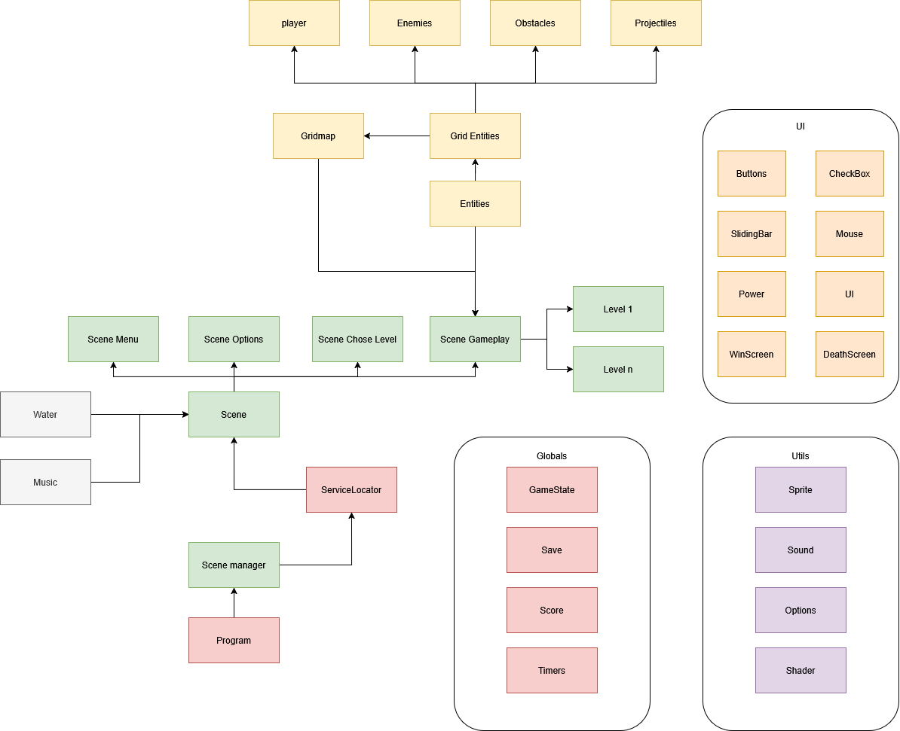

# Simple Boat Game

## Principe du jeu
**Simple Boat Game** est un puzzle-game basé sur la gestion du timing. Le jeu repose sur le pouvoir principal du joueur : envoyer les ennemis dans une autre dimension pour un certain nombre de tours.  
Ce pouvoir peut être utilisé de diverses manières : pour détruire les ennemis, survivre ou modifier les timings afin de les forcer à s'entretuer.

## Joueur
- Le joueur peut se déplacer **deux fois par seconde**.
- Il génère une **zone d'influence** autour de lui. Les ennemis ou obstacles situés dans cette zone peuvent être envoyés dans une autre dimension pour un nombre de tours défini.

## Ennemis
- Les ennemis se déplacent **une fois par seconde**, tous en même temps.
- Ils peuvent tirer des **missiles** qui se déplacent perpendiculairement à leur direction de déplacement.

## Obstacles
Il existe plusieurs types d'obstacles :
- **Immobiles** ou **déplaçables** par le joueur.
- **Indestructibles**, **destructibles**, ou **explosifs**.

## But du jeu
L'objectif est d'éliminer **tous les ennemis** de chaque niveau.  
Un score est attribué à la fin du niveau en fonction de :
- **Nombre de mouvements effectués**.
- **Nombre de fois où le pouvoir a été utilisé**.
- **Temps écoulé**.

## Contrôles
- **Déplacement** :
  - ↑ / Z : Haut  
  - ↓ / S : Bas  
  - ← / Q : Gauche  
  - → / D : Droite  

- **Gestion du pouvoir** :
  - **1-5** : Définir le nombre de tours avant le retour de l'ennemi.  
  - **Alt Droite** / **Ctrl Gauche** : Diminuer le nombre de tours.  
  - **Shift Droite** / **Shift Gauche** : Augmenter le nombre de tours.  
  - **Clic gauche** : Envoyer dans le passé.  

- **Autres actions** :
  - **R** : Redémarrer le niveau.  
  - **Espace** : Mettre le jeu en pause.  
  - **Échap** : Retourner au menu principal.  

## Originalité

L'originalité du jeu réside dans la gestion des entités envoyées dans une autre dimension.  
Chaque **tuile** de la grille possède **un élément courant** et **un élément dans le passé**.  

Lorsqu'une entité revient dans notre dimension, elle vérifie si une autre entité occupe déjà la même tuile.  
Si c'est le cas, **les deux entités subissent des dégâts**.  

Ce mécanisme est entièrement géré par le code présent dans **[GridMap](Grid/GridMap.cs)**.

## Code Source
### Structure

### Gridmap
Chaque entité est positionnée sur la grille en fonction de sa colonne et de sa ligne.  
Les déplacements sont gérés via la fonction **`move`**.  

Certaines entités ont la capacité de **pousser** d'autres entités. Dans ce cas, elles appellent la fonction **`move`** sur la case vers laquelle elles souhaitent se déplacer.  

Pour rendre les mouvements plus fluides, la fonction **`move`** met à jour une **position cible** (*target position*).  
Le déplacement ainsi que la gestion des collisions sont ensuite effectués dans la boucle **`update`**.
La majorité de l'intelligence est comprise dans ces deux fonctions. 
Le reste est compris dans la gestion de l'envoie dans une autre dimension

### Service Locator
Le service locator est utilisé pour stocker et récuperer le scene manager a chaque fois qu'on en a besoin. 